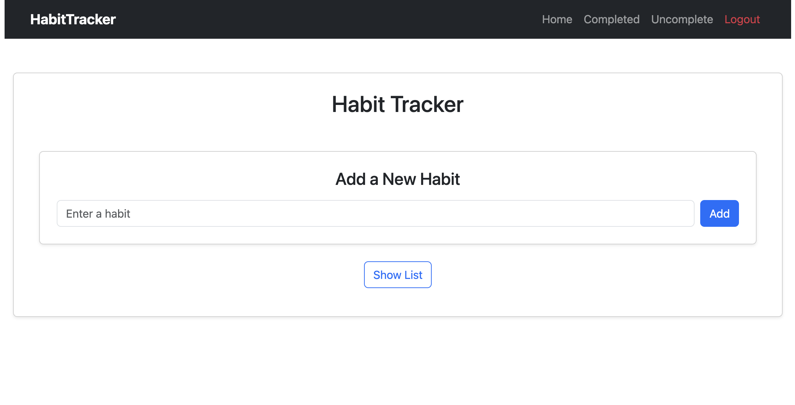
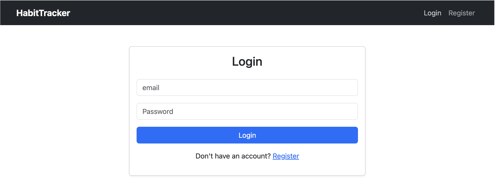
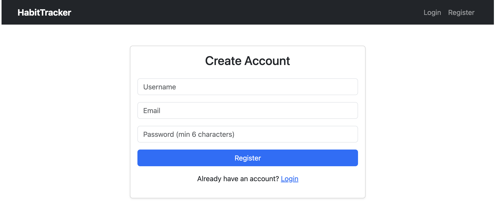
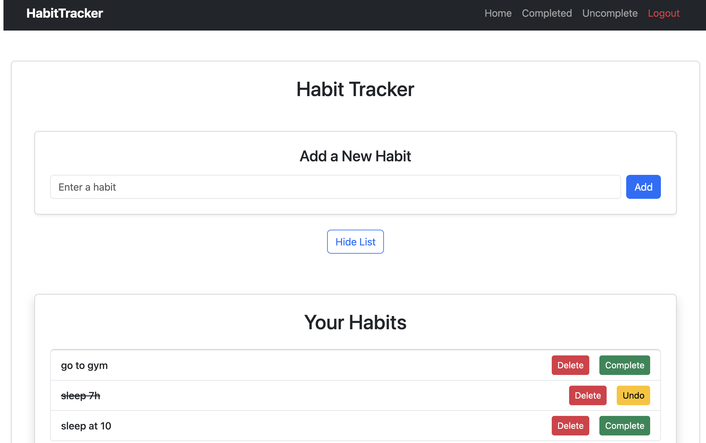

# Habit Tracker - Full Stack MERN Application

A clean, modern habit tracking app with user authentication. Built to demonstrate full-stack development skills with the MERN stack.



## ✨ Features

- User registration and login (JWT authentication)
- Full CRUD operations for habits
- Protected routes (only authenticated users can access habits)
- Responsive design with Bootstrap
- Real-time habit status updates (complete / undo)

## 🛠️ Tech Stack

**Frontend:** React.js, React Router, Bootstrap, Context API  
**Backend:** Node.js, Express.js  
**Database:** MongoDB with Mongoose  
**Authentication:** JWT + bcryptjs

## 🚀 Live Demo
[View Live Demo](your-vercel-link-here)   ← We'll add this after deployment

## 📸 Screenshots






## 🏃 How to Run Locally

### Backend
```bash
cd backend
npm install
npm run dev

### Frontend
```bash
cd frontend
npm install
npm run dev

📌 What I Learned

Building a full-stack application with separate frontend and backend
Implementing JWT-based authentication and protected routes
Connecting React frontend to a Node.js + MongoDB backend
Managing global authentication state with React Context
Handling async operations, error states, and loading indicators

📄 License
MIT